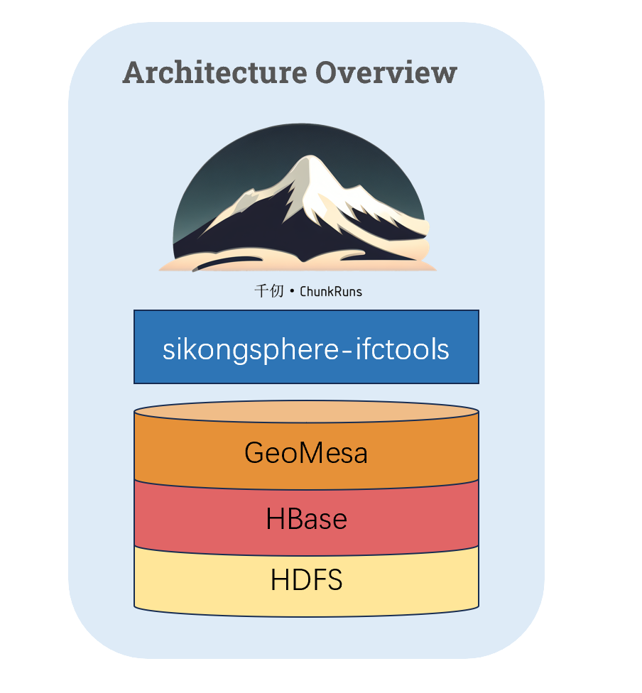

[**中文**](./README.md) | [**English**](./README.en.md)

# 千仞：基于分布式计算系统的面向海量城市数据查询与分析的工具包

  <a href="#"></img></a>

 <a href='https://gitee.com/sikongsphere/chunk-runs/stargazers'></img></a>

## 介绍

**千仞（ChunkRuns）** 是一个基于分布式计算系统的面向海量城市数据查询与分析的工具包。在开源的地理空间数据管理平台GeoMesa的基础上为大规模IFC数据提供高效的分布式存储、索引、查询和分析计算的能力。

#### 功能特性

千仞提供如下功能：

 - **BIM数据存储**：支持IFC文件批量导入，构建空间划分标识并存储在分布式列存储Hbase数据库上。
 - **空间索引**： 根据构件在三维空间中的位置建立空间索引，提供高效的空间查询能力。
 - **BIM查询**：支持按名称或按类型的查询，支持空间查询，支持空间查询与属性查询的组合查询。

<!-- 未来千仞还将提供如下功能：
 - **空间计算函数**：为BIM的构件提供空间计算函数，如距离计算、相交计算、包含、求表面积、体积等。
 - **集成**：使用第三方工具（如QGIS、GeoServer、ArcGIS、Tableau和MapServer）访问和使用ChunkRuns。 -->

### 软件架构

千仞的架构如下图所示：

  </img>

千仞的架构主要包括三个部分：
 - **IFC解析**：[Sikongsphere-ifctools](https://gitee.com/sikongsphere/sikongsphere-ifctools)是一个完全实现IFC标准的开源模型库。通过ifctools解析IFC文件，将模型中的构件信息提取出来。
 - **数据存储**：HBase是一个分布式的、面向列的开源数据库，它运行在HDFS之上，提供对海量数据的高效存储和访问能力。HBase作为数据存储，以空间划分标识编码为主键组织数据。
 - **数据索引**：千仞使用GeoMesa辅助构建空间索引，为海量BIM数据提供高效的索引和查询能力。

## 参与贡献

请浏览[贡献指南]()以了解如何参与到项目中。

## 版权声明

本项目采用Apache许可证2.0授权 - 详情请看[LICENSE](./LICENSE)